# Krishi Mitra

## Problem Statement

Agricultural data in India is often siloed, non-visual, and delayed, making it hard for policymakers, researchers, and farmers to make informed decisions. There is a clear need for an intuitive, real-time dashboard that visualizes crop yield trends across Indian states, highlighting factors like weather patterns, soil quality, and seasonal impacts.

## Overview

Krishi Mitra is an application designed to address these challenges by providing:

- A real-time dashboard to visualize crop yield trends.
- Insights into factors such as weather patterns, soil quality, and seasonal impacts.
- An e-commerce platform for direct transactions between farmers and buyers.

## Features

- **Real-Time Visualization**: Interactive dashboards to explore crop yield trends across Indian states.
- **Data Analytics**: Insights powered by Streamlit to analyze weather, soil, and seasonal data.
- **User Authentication**: Secure login and registration using Node.js.
- **E-Commerce**: A platform for direct transactions between farmers and buyers.

## Tech Stack

- **Frontend**: React.js
- **Backend**: Node.js for user authentication
- **Data Analytics**: Streamlit for data visualization and analysis

## Screenshots

Below are some screenshots of the application:

### Dashboard Visualization

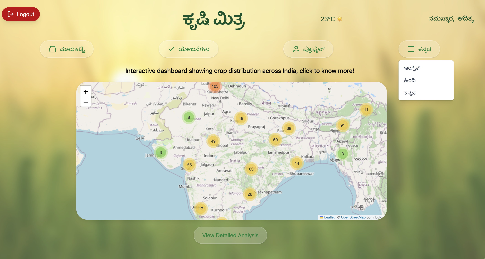

### User Authentication

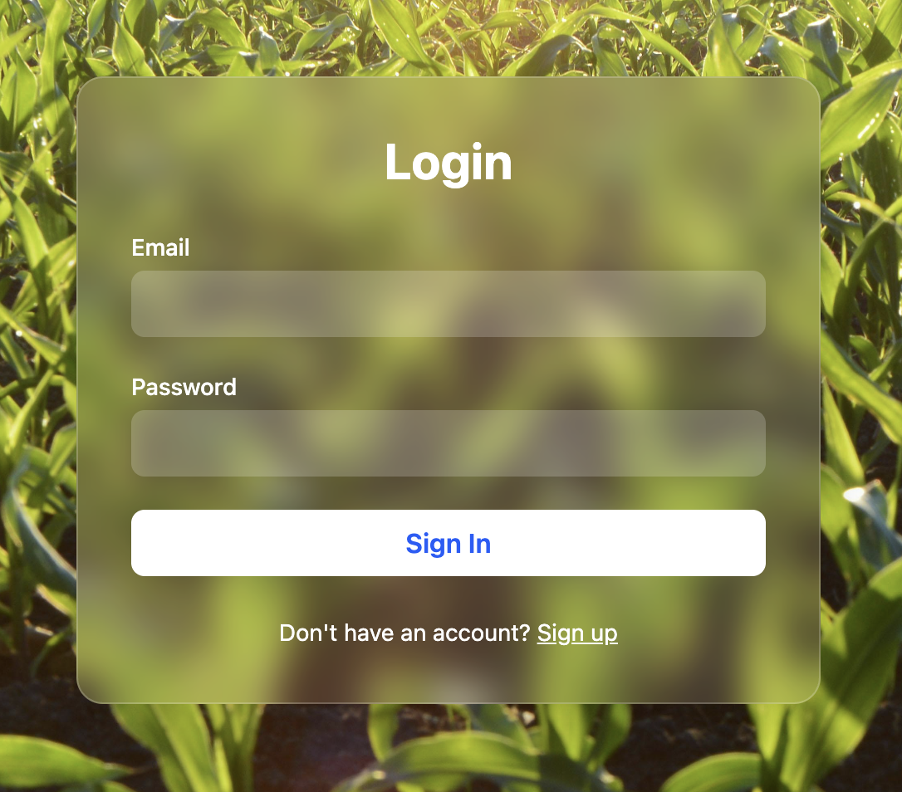

### Profile Interface

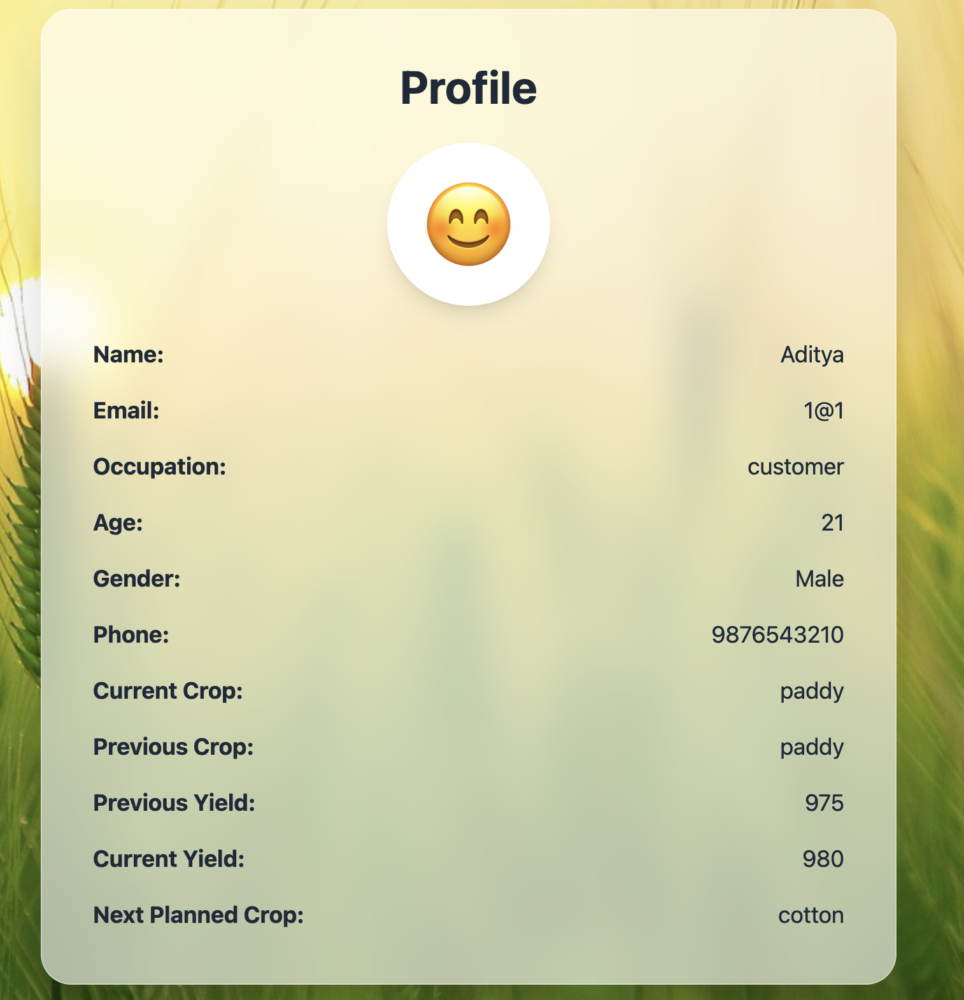

### Register Interface

### E-Commerce Interface

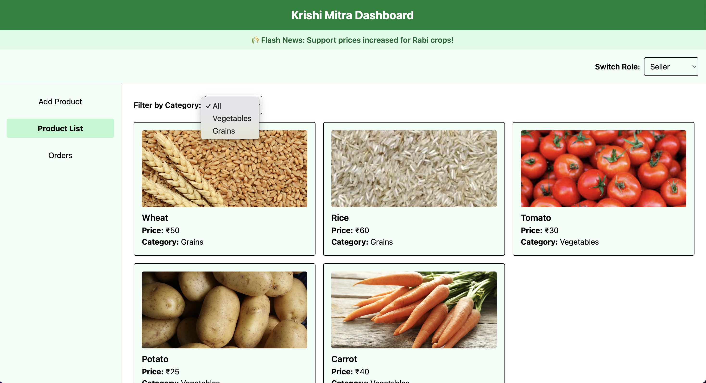

### Scheme Interface

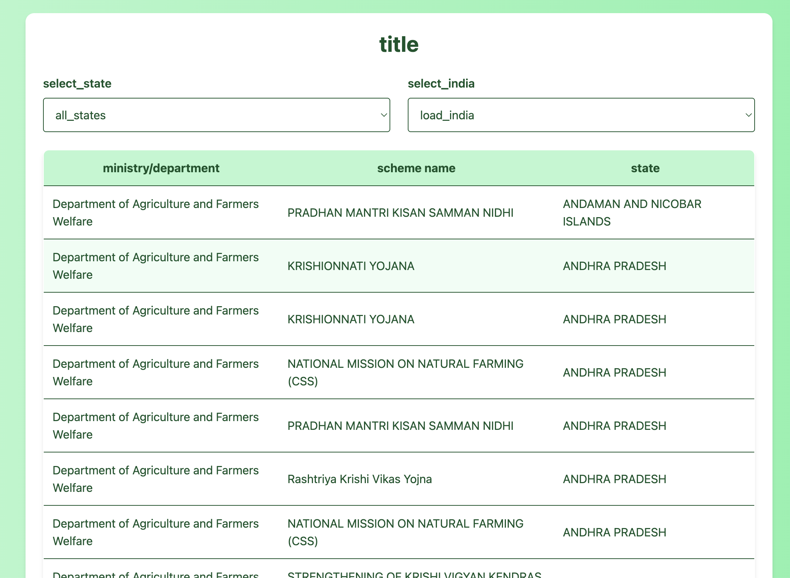

### graph Interface

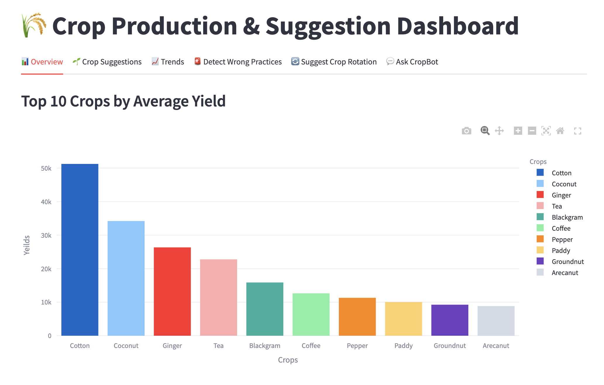

### piechart Interface

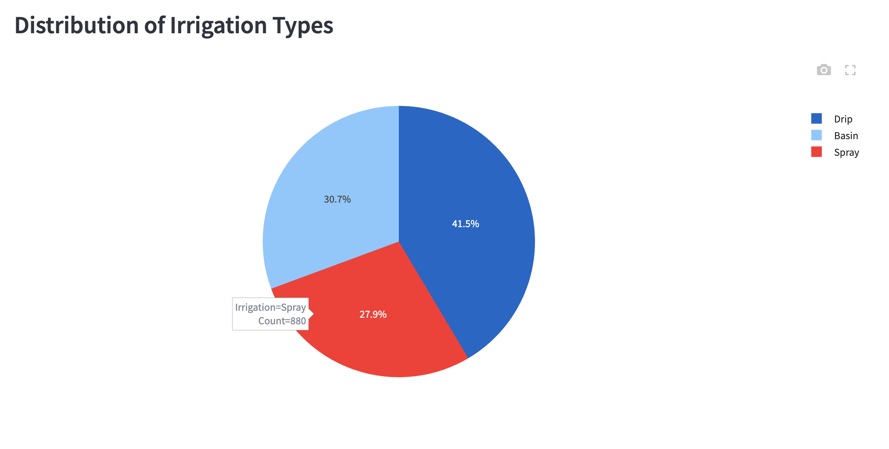

### suggestion Interface

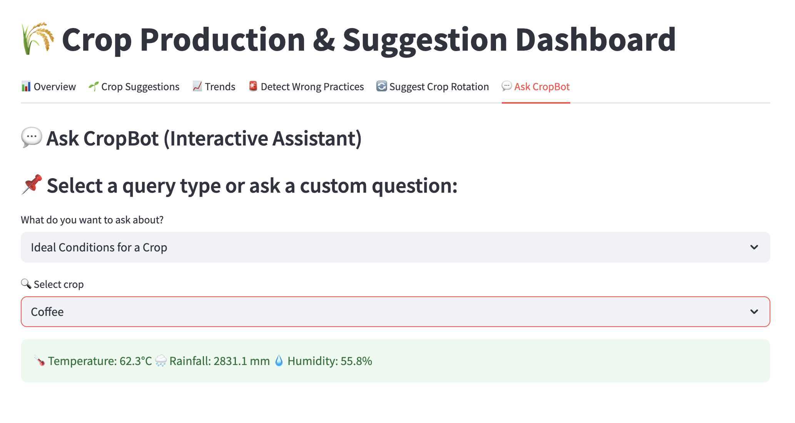

### crop rotation Interface

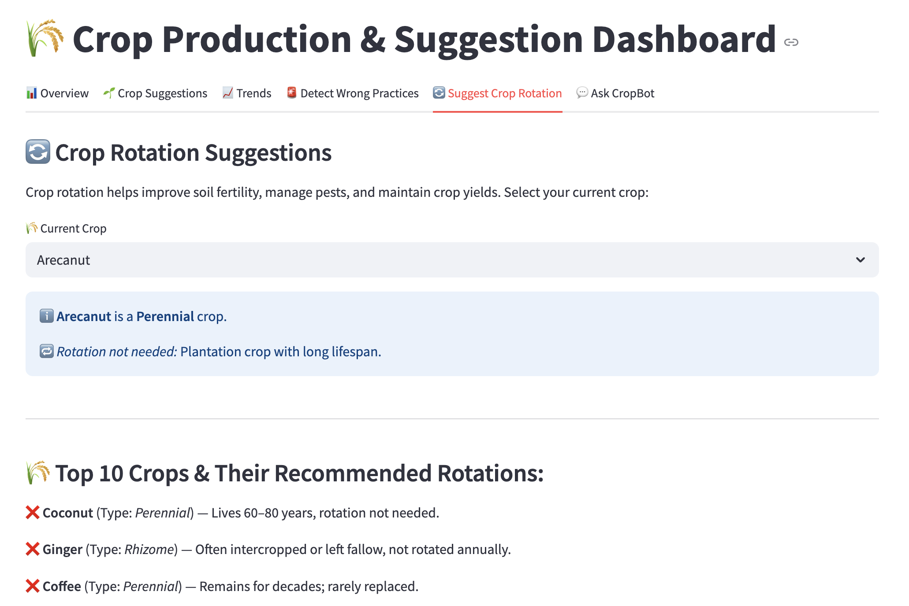

### piechart Interface

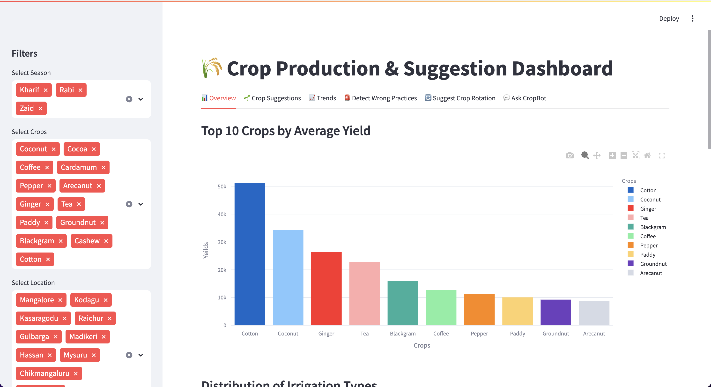

### Crop Advisor Interface

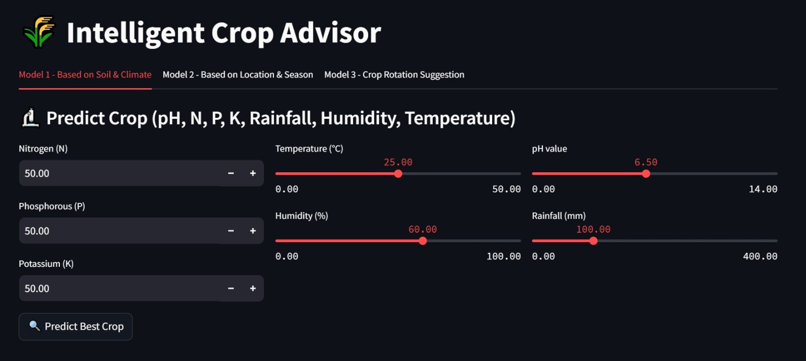

### Seller Dashboard Interface

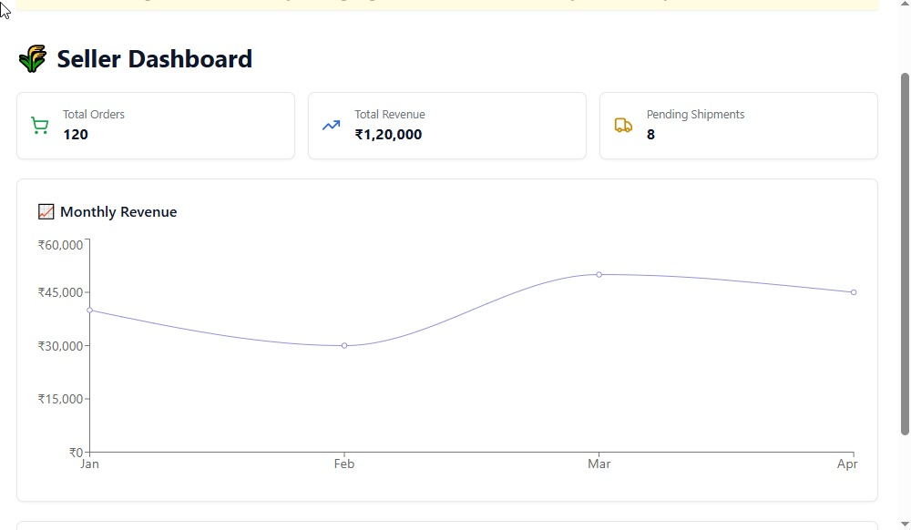

## License

This project is licensed under the GNU General Public License v3.0. See the LICENSE file for details.

## Contact

For any queries, please contact the project maintainers via email or through the repository's issue tracker.
